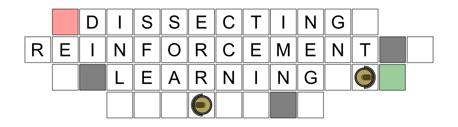

<div style="text-align:center"></div>

This repository contains the code and pdf of a series of blog post called "dissecting reinforcement learning" which I published on my blog [mpatacchiola.io/blog](https://mpatacchiola.github.io/blog/). Moreover there are links to resources that can be useful for a reinforcement learning practitioner. **If you have some good references which may be of interest please send me a pull request and I will integrate them in the README**.

The source code is contained in [src](./src) with the name of the subfolders following the post number. In [pdf](./pdf) there are the A3 documents of each post for offline reading. In [images](./images) there are the raw svg file containing the images used in each post.

Installation
------------

The source code does not require any particular installation procedure. The code can be used in **Linux**, **Windows**, **OS X**, and embedded devices like **Raspberry Pi**, **BeagleBone**, and **Intel Edison**. The only requirement is *Numpy* which is already present in Linux and can be easily installed in Windows and OS X through [Anaconda](https://conda.io/docs/install/full.html) or [Miniconda](https://conda.io/miniconda.html). Some examples require [Matplotlib](https://matplotlib.org/) for data visualization and animations.

Posts Content
------------

1. [[Post one]](https://mpatacchiola.github.io/blog/2016/12/09/dissecting-reinforcement-learning.html) [[code]](./src/1) [[pdf]](./pdf) - Markov chains. Markov Decision Process. Bellman Equation. Value and Policy iteration algorithms. 

2. [[Post two]](https://mpatacchiola.github.io/blog/2017/01/15/dissecting-reinforcement-learning-2.html) [[code]](./src/2) [[pdf]](./pdf) - Monte Carlo methods for prediction and control. Generalised Policy Iteration. Action Values and Q-function.

3. [[Post three]](https://mpatacchiola.github.io/blog/2017/01/29/dissecting-reinforcement-learning-3.html) [[code]](./src/3) [[pdf]](./pdf) - Temporal Differencing Learning, Animal Learning, TD(0), TD(λ) and Eligibility Traces, SARSA, Q-Learning.

4. [[Post four]](https://mpatacchiola.github.io/blog/2017/02/11/dissecting-reinforcement-learning-4.html) [[code]](./src/4) [[pdf]](./pdf) - Neurobiology behind Actor-Critic methods, computational Actor-Critic methods, Actor-only and Critic-only methods.

5. [[Post five]](https://mpatacchiola.github.io/blog/2017/03/14/dissecting-reinforcement-learning-5.html) [[code]](./src/5) [[pdf]](./pdf) - Evolutionary Algorithms introduction, Genetic Algorithm in Reinforcement Learning, Genetic Algorithms for policy selection.

6. [[Post six]](https://mpatacchiola.github.io/blog/2017/08/14/dissecting-reinforcement-learning-6.html) [[code]](./src/6) [[pdf]](./pdf) - Reinforcement learning applications, Multi-Armed Bandit, Mountain Car, Inverted Pendulum, Drone landing, Hard problems.

7. [[Post seven]](https://mpatacchiola.github.io/blog/2017/12/11/dissecting-reinforcement-learning-7.html) [[code]](./src/7) [[pdf]](./pdf) - Function approximation, Intuition, Linear approximator, Applications, High-order approximators.

8. [[Post eight]](https://mpatacchiola.github.io/blog/2018/12/28/dissecting-reinforcement-learning-8.html) [[code]](./src/8) [[pdf]](./pdf) - Non-linear function approximation, Perceptron, Multi Layer Perceptron, Applications, Policy Gradient.

Environments
-------------

The folder called `environments` contains all the environments used in the series. Differently from other libraries (such as OpenAI Gym) the environments are stand-alone python files that do no require any installation procedure. You can use an environment copying the file in the same folder of your project, and then loading it from a Python script: `from environmentname import EnvironmentName`. The environment can be used following the same convention adopted by OpenAI Gym:

```python
from random import randint #to generate random integers
from inverted_pendulum import InvertedPendulum #importing the environment

#Generating the environment
env = InvertedPendulum(pole_mass=2.0, cart_mass=8.0, pole_lenght=0.5, delta_t=0.1)
#Reset the environment before the episode starts
observation = env.reset(exploring_starts=True) 

for step in range(100):
    action = randint(0, 2) #generate a random integer/action
    observation, reward, done = env.step(action) #one step in the environment
    if done == True: break #exit if the episode is finished

#Saving the episode in a GIF
env.render(file_path='./inverted_pendulum.gif', mode='gif')
```

The snippet above generate an inverted pendulum environment. The pole is controlled through three actions (0=left, 1=noop, 2=right) that are randomly generated through the `randint()` method. The maximum number of steps allowed is 100, that with `delta_t=0.1` corresponds to 10 seconds. The episode can finish in advance if the pole falls down leading to `done = True`. Examples for each environments are available [here](./src/6). The following is a description of the available environments with a direct link to the python code:

- **grid world**: a simple grid-world which includes obstacles, walls, positive and negative rewards. An agent can move in the environment using four actions (0=forward, 1=right, 2=backward, 3=left). It is possible to setup the dimension of the world, the location of the obstacles, and the movement noise [[code]](./environments/gridworld.py) 

- **multi-armed bandit**: implementation of a [multi-armed](https://en.wikipedia.org/wiki/Multi-armed_bandit) environment that can be initialized with a specific number of arms. Rewards are binary (1 or 0) and are given for each arm with a pre-defined probability. This world does not have a `reset()` method because for definition the episode only has a single step [[code]](./environments/multi_armed_bandit.py)

- **inverted pendulum**: it is an implementation of the [classic problem](https://en.wikipedia.org/wiki/Inverted_pendulum) widely used in control theory. The pendulum can be initialized with a specific pole mass, cart mass, and pole length. There are three possible actions (0=left, 1=noop, 2=right). A method called `render()` allows saving a GIF or an MP4 of the last episode using Matplotlib [[code]](./environments/inverted_pendulum.py)

- **mountain car**: implementation of the [classic problem](https://en.wikipedia.org/wiki/Mountain_car_problem) which is a widely used benchmark. The environment is initialized with a specific mass for the car, friction for the soil, and delta time. There are only three actions available (0=left, 1=noop, 2=right). Rendering is possible and allows saving a GIF or video using Matplotlib animations [[code]](./environments/mountain_car.py)

- **drone landing**: a drone has to land on a pad at the centre of a cubic room, moving in six possible directions (0=forward, 1=left, 2=backward, 3=right, 4=up, 5=down). The dimension of the world can be declared during the initialization. Positive reward of +1 is obtained if the drone touch the pad, whereas a negative reward of -1 is given in case of a wrong landing. Rendering is allowed and the file is stored as GIF or MP4 [[code]](./environments/drone_landing.py)


Resources
---------

**Software:**

- [[Google DeepMind Lab]](https://deepmind.com/blog/open-sourcing-deepmind-lab/) [[github]](https://github.com/deepmind/lab) - DeepMind Lab is a fully 3D game-like platform tailored for agent-based AI research.

- [[OpenAI Gym]](https://gym.openai.com/) [[github]](https://github.com/openai/gym) - A toolkit for developing and comparing reinforcement learning algorithms.

- [[OpenAI Universe]](https://universe.openai.com/) [[github]](https://github.com/openai/universe) - Measurement and training for artificial intelligence.

- [[RL toolkit]](http://incompleteideas.net/rlai.cs.ualberta.ca/RLAI/RLtoolkit/RLtoolkit1.0.html) - Collection of utilities and demos developed by the RLAI group which may be useful for anyone trying to learn, teach or use reinforcement learning (by Richard Sutton).

- [[setosa blog]](http://setosa.io/blog/2014/07/26/markov-chains/index.html) - A useful visual explanation of Markov chains.

- [[Tensorflow playground]](https://playground.tensorflow.org) - Try different MLP architectures and datasets on the browser.

**Books and Articles:**

- **Artificial intelligence: a modern approach. (chapters 17 and 21)** Russell, S. J., Norvig, P., Canny, J. F., Malik, J. M., & Edwards, D. D. (2003). Upper Saddle River: Prentice hall. [[web]](http://aima.cs.berkeley.edu/) [[github]](https://github.com/aimacode)

- **Christopher Watkins** doctoral dissertation, which introduced the **Q-learning** for the first time [[pdf]](https://www.researchgate.net/profile/Christopher_Watkins2/publication/33784417_Learning_From_Delayed_Rewards/links/53fe12e10cf21edafd142e03/Learning-From-Delayed-Rewards.pdf)

- **Evolutionary Algorithms for Reinforcement Learning.** Moriarty, D. E., Schultz, A. C., & Grefenstette, J. J. (1999). [[pdf]](https://www.jair.org/media/613/live-613-1809-jair.pdf)

- **Machine Learning (chapter 13)** Mitchell T. (1997) [[web]](http://www.cs.cmu.edu/~tom/mlbook.html)

- **Reinforcement learning: An introduction.** Sutton, R. S., & Barto, A. G. (1998). Cambridge: MIT press. [[html]](https://webdocs.cs.ualberta.ca/~sutton/book/ebook/the-book.html)

- **Reinforcement learning: An introduction (second edition).** Sutton, R. S., & Barto, A. G. (draft April 2018). [TODO]

- **Reinforcement Learning in a Nutshell.** Heidrich-Meisner, V., Lauer, M., Igel, C., & Riedmiller, M. A. (2007) [[pdf]](http://citeseerx.ist.psu.edu/viewdoc/download?doi=10.1.1.69.9557&rep=rep1&type=pdf)

- **Statistical Reinforcement Learning: Modern Machine Learning Approaches**, Sugiyama, M. (2015) [[web]](https://www.crcpress.com/Statistical-Reinforcement-Learning-Modern-Machine-Learning-Approaches/Sugiyama/p/book/9781439856895)


License
--------
The MIT License (MIT)
Copyright (c) 2017 Massimiliano Patacchiola
Website: http://mpatacchiola.github.io/blog

THE SOFTWARE IS PROVIDED "AS IS", WITHOUT WARRANTY OF ANY KIND, EXPRESS OR IMPLIED, INCLUDING BUT NOT LIMITED TO THE WARRANTIES OF MERCHANTABILITY, FITNESS FOR A PARTICULAR PURPOSE AND NONINFRINGEMENT. IN NO EVENT SHALL THE AUTHORS OR COPYRIGHT HOLDERS BE LIABLE FOR ANY 
CLAIM, DAMAGES OR OTHER LIABILITY, WHETHER IN AN ACTION OF CONTRACT, TORT OR OTHERWISE, ARISING FROM, OUT OF OR IN CONNECTION WITH THE 
SOFTWARE OR THE USE OR OTHER DEALINGS IN THE SOFTWARE.
